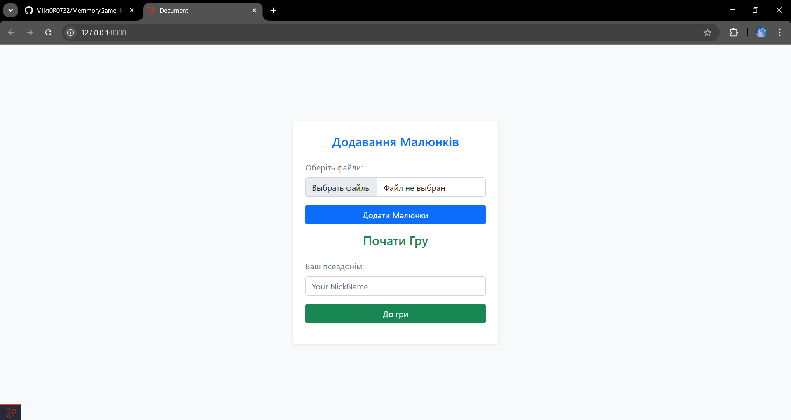
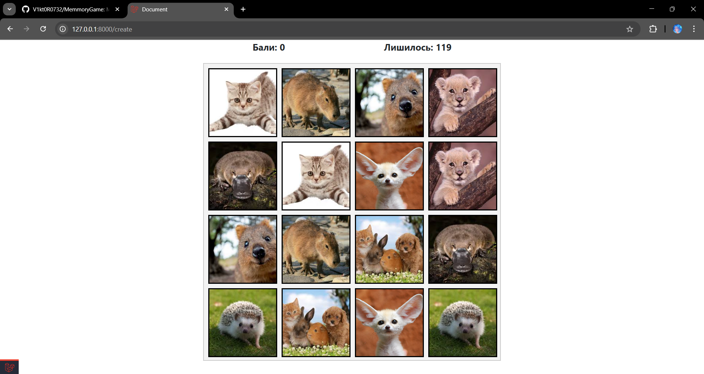
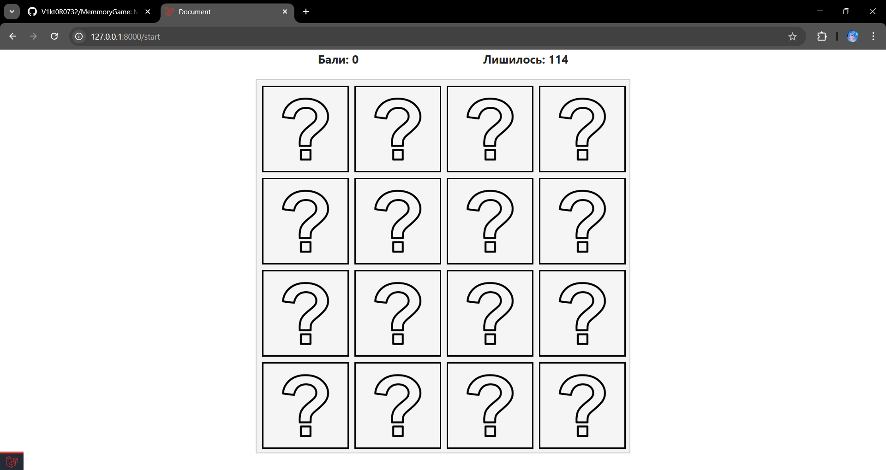
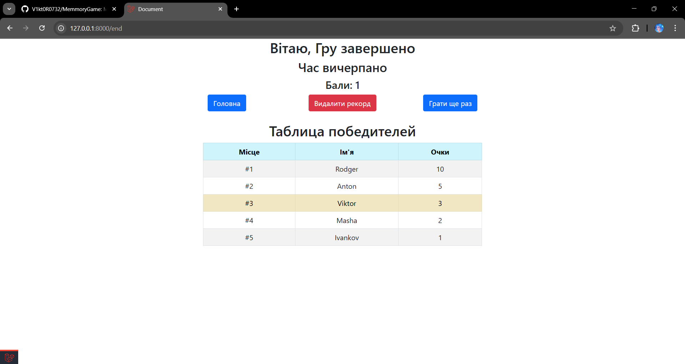

# 🧩 Memory Game

Гра на час, створена на основі Laravel 11. Мета гравця — відкрити всі пари картинок за відведені 5 хвилин.

## 🚀 Функціонал

- **Авторизація:** гравець вводить своє ім'я та може додавати нові картинки до бази даних.
- **Геймплей:** гравцеві показуються 8 випадкових пар картинок на 5 секунд, після чого починається гра на полі 4x4.
- **Ігровий процес:**
  - Гравець відкриває картинки по черзі.
  - Якщо картинки співпадають — вони залишаються відкритими.
  - Таймер показує залишок часу зверху.
  - Бали відображаються ліворуч від таймера.
- **Завершення гри:** по закінченню часу показується екран з результатом та таблицею лідерів, відсортованою за набраними балами.
- **Рейтинг:** гравець може побити свій попередній рекорд, дані в базі даних оновлюються автоматично.

## 🖥️ Вимоги

- PHP 8.2 або вище
- Laravel 11
- MySQL 8.0+
- Composer

## 📦 Встановлення

1. Клонувати репозиторій:
   ```bash
   git clone https://github.com/username/memory-game.git
   cd memory-game
   ```
2. Встановити залежності Laravel:
   ```bash
   composer install
   ```
3. Налаштувати файл `.env` для підключення до вашої бази даних MySQL.
4. Запустити міграції для створення таблиць:
   ```bash
   php artisan migrate
   ```
5. Запустити сервер:
   ```bash
   php artisan serve
   ```
6. Перейти за адресою [http://localhost:8000](http://localhost:8000).

## 🎮 Скриншоти

Додайте сюди скріншоти ігрового процесу для наочності:

- **Екран авторизації:** ;
- **Ігрове поле:** ;
- **Ігрове поле 2:** 
- **Таблиця лідерів:** ;

## ⚙️ Використання

1. Зареєструйтесь, ввівши своє ім'я.
2. Додайте картинки до бази даних.
3. Почніть гру та спробуйте відкрити всі пари за 5 хвилин.
4. Порівняйте свої результати з іншими гравцями у таблиці лідерів.

## 🏆 Система нарахування балів

- **+1 бал за кожен пройдений єтап.**

## 🚩 Поширені помилки та їх вирішення

- **Помилка підключення до бази даних:**

  - Перевірте правильність налаштування файлу `.env`.
  - Переконайтеся, що сервер MySQL запущений.

- **Помилка міграції:**

  - Використайте `php artisan migrate:fresh` для скидання бази даних.

- **Сторінка не завантажується після авторизації:**

  - Очистіть кеш сесій: `php artisan config:cache && php artisan cache:clear`.

## 🤝 Внесок у проєкт

Буду радий будь-яким пропозиціям щодо покращення гри!

1. Форкніть репозиторій.
2. Створіть нову гілку (`git checkout -b feature/нова-функція`).
3. Внесіть зміни та закомітьте їх (`git commit -m 'Додано нову функцію'`).
4. Відправте зміни на GitHub (`git push origin feature/нова-функція`).
5. Створіть Pull Request.

## 📄 Ліцензія

Цей проєкт поширюється під ліцензією MIT.

## 📬 Контакти

Якщо у вас є питання або пропозиції:

- **Email:**  Viktor0732@ukr.net | Viktor07322370@gmail.com | 7999233@stud.kai.edu.ua
- **GitHub:** [github.com/username](https://github.com/V1kt0R0732)

